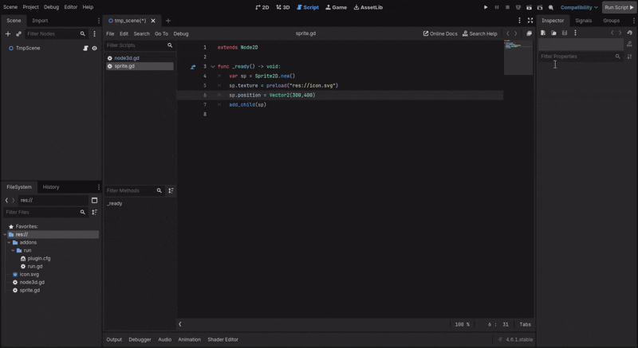

A simple script that allows you to run GDScript without having to create a scene. Created for this [issue](https://github.com/godotengine/godot-proposals/issues/14772#issue)

---

## How it works

1. Adds a toolbar button labeled **Run Script ▶** when the plugin loads.
2. When pressed, it gets the currently open script file path from the script editor.
3. Reads the script text and finds the class it extends (line starting with `extends`).
4. If that base class exists in Godot, instantiates it as a Node.
5. Creates a `res://tmp` folder (if missing), sets the instantiated node’s script to the current script, packs it into a `PackedScene`, and saves it as `res://tmp/tmp_scene.tscn`.
6. Opens the saved scene in the editor and starts the scene in the editor (play).
7. Tracks that a temporary scene was created and prints a message when the editor stops playing (TODO: clean up the tmp file).

Notes / edge cases:
- If the script file is missing or unreadable, the plugin logs and returns.
- If the `extends` line isn’t found or the base class doesn’t exist, nothing is run.
- Errors saving or packing the scene are reported via `push_error`.
- Cleanup of the temporary scene file is not implemented yet (marked TODO).
